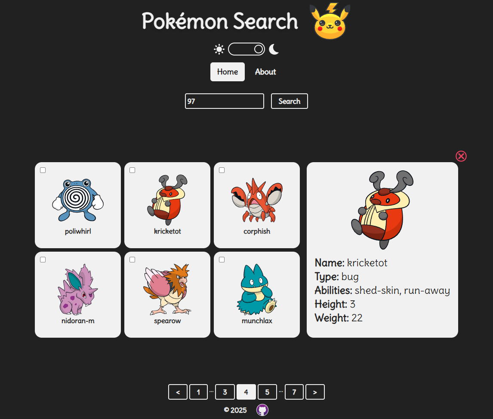
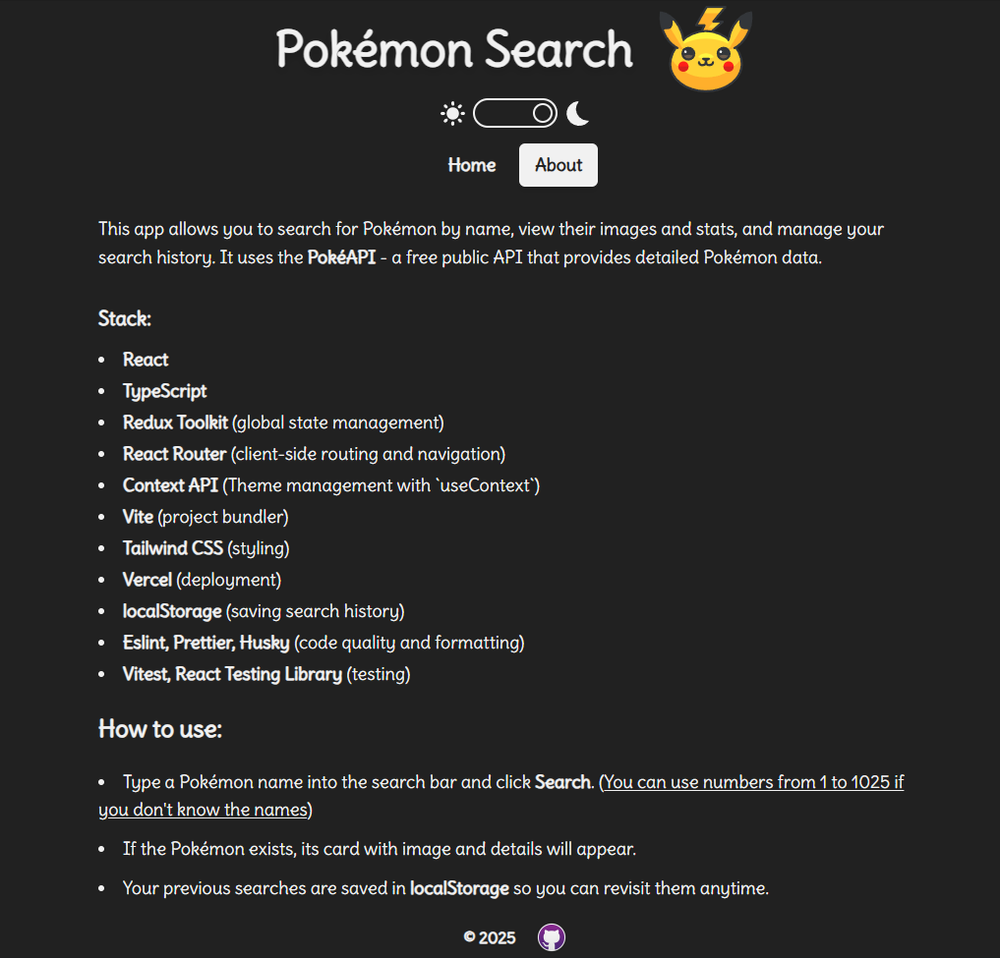

# Pokémon Search 

**Pokémon Search** — this is a project built with **React**.  
The project allows searching for Pokémon and displaying their characteristics, including image, type, and basic stats.

## Deploy - [Link](https://poke-explore.vercel.app)

## 📝 Features

- Search Pokémon by name. (You can use numbers from 1 to 1025 if you don't know the names)
- Display a list of results with basic information: name, type, image, etc.
- Theme switching - toggle between light and dark mode
- Download Pokémon data - Export selected card information as CSV file
- Store recent search history in `localStorage`.
- Error handling using a custom **ErrorBoundary**.
- Responsive design using **Tailwind CSS**.

## 🧪 Testing & Coverage

- Full test coverage using **Vitest** and **React Testing Library**.

- 84 tests across 17 files, including unit and integration tests for components, API calls, loading states, error handling, and localStorage.

## ⚙️ Technologies

- **React**
- **TypeScript**
- **Redux Toolkit** (global state management)
- **React Router** (client-side routing and navigation)
- **Context API** - Theme management with `useContext`
- **Vite** (project bundler)
- **Tailwind CSS** (styling)
- **Vercel** (deployment)
- **localStorage** (saving search history)
- **Eslint**, **Prettier**, **Husky** (code quality and formatting)
- **Vitest**, **React Testing Library** (testing)

## 📸 Screenshots




## 🚀 Installation & Running

```bash
git clone https://github.com/kevaniy0/pokemon-search.git
cd pokemon-search
npm install
npm run dev
```
